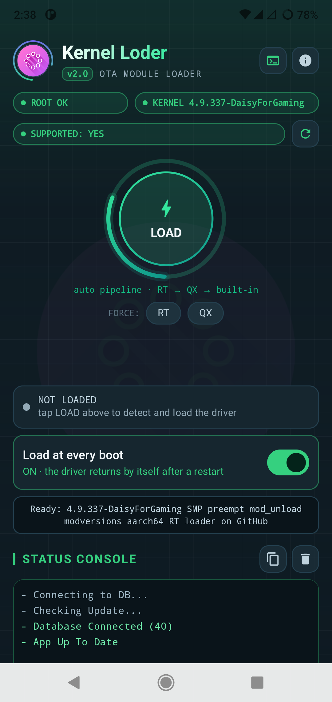
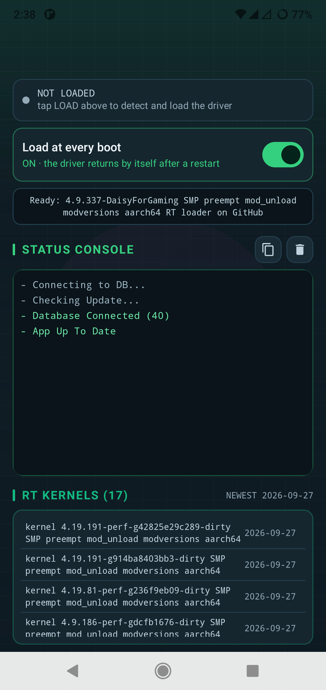

<div align="center">


# ⚡ Kernel Loder

### OTA Kernel Module Loader for Android
**One tap · Detects your kernel · Downloads the right driver · Loads it**

[](../../releases/latest)
[](#-requirements)
[](#-requirements)
[](LICENSE)

</div>

---

**Kernel Loder** is a root-powered Android app that loads kernel modules (`.ko`) on any
arm64 device. It reads your **exact running kernel**, finds a matching driver in the
**OTA driver database** (40+ prebuilt kernels), loads it through a safe pipeline and
verifies the result — all from one clean, dark interface.

No device hunting. No adb. No manual `insmod`.

## 📱 Screenshots

| Home | Pipeline & DB |
|---|---|
|  |  |

---

## ✨ Features

- ⚡ **One-tap LOAD** — auto pipeline: **RT → QX → built-in**. If the RT driver fails, QX
  is tried automatically, then the built-in universal loader.
- 🎯 **Exact kernel matching** — the app reads `uname -r` and resolves an **exact**
  prebuilt driver from the OTA database (40+ kernels, growing).
- 🛑 **STOP button** — any load can be cancelled mid-pipeline with one tap.
- 🗒️ **Status console** — short, colour-coded live status of every step
  (`Database Connected`, `Driver loaded`, `Load OK`...).
- 🔀 **RT / QX separation** — supported-kernel lists are split per ABI
  (`RT KERNELS` / `QX KERNELS`) with `THIS DEVICE` / `NEWEST` badges.
- 🔁 **Boot auto-load** — the driver re-loads itself after every reboot via a
  Magisk/APatch service script.
- 🧾 **Auto build-request reports** — unsupported kernel? The app collects everything a
  builder needs (see below) and hands you a ready-made WhatsApp message or GitHub issue.
- 📲 **In-app updates** — the app checks GitHub releases and can install its own update.
- 🛡️ **Anti-tamper** — signature check, debugger/Xposed refusal, obfuscated release
  builds (see [Security](#-security)).

## 📥 Download

Grab the latest APK from the [**Releases**](../../releases/latest) page and install it.
The app checks for updates by itself — when a new version is out it offers a
one-tap in-app install.

## ✅ Requirements

| Item | Requirement |
|---|---|
| Root | **Magisk**, **KernelSU** or **APatch** (grant Superuser on first use) |
| Architecture | arm64 / aarch64 |
| Android | 9.0 (API 28) or newer |
| Internet | Needed to fetch the driver database and updates |

## 🚀 Quick start

1. Install the APK and open it — grant **Superuser** when asked.
2. Wait for `Database Connected` in the status console.
3. Tap **LOAD** — the pipeline detects your kernel, downloads the matching driver,
   loads it and verifies the `/dev` node.
4. (Optional) switch **Load at every boot** ON — the driver survives reboots.
5. Wrong driver family? Force **RT** or **QX** with the chips under LOAD.

## 🧭 How the load pipeline works

```
tap LOAD
   │
   ▼
Stage 1/3 · RT driver ── local staged .ko → OTA DB exact match → download → insmod → verify /dev
   │  fail?
   ▼
Stage 2/3 · QX driver ── same flow with the QX ABI build
   │  fail?
   ▼
Stage 3/3 · Built-in ─── embedded universal loader
   │
   ▼
verify: lsmod + /dev node → boot auto-load staged
```

Every stage is cancellable with the **STOP** button, and each ABI's logs stay tagged so
they can be filtered later in the full console (`ALL · STATUS · RT · QX`).

## 🧾 Reporting an unsupported kernel

If your kernel has no match, the app builds a **complete build request** for you:

- exact `uname -r` + architecture + page size
- `/proc/version` (compiler string)
- **vermagic** extracted from an on-device module
- kernel **config flags** from `/proc/config.gz` (`SMP`, `PREEMPT`,
  `MODVERSIONS`, `MODULE_UNLOAD`, `LOCALVERSION`…)
- device identity (model, board, SoC, fingerprint)
- `dmesg` tail + full load log

Tap **WhatsApp** to send it as a chat message, **Report** to open a pre-filled GitHub
issue, or **Copy full report** to paste it anywhere. A maintainer builds the matching
`.ko`, pushes it to the driver database, and your app finds it on the next refresh.

## 🔨 Building the app

```bash
git clone https://github.com/bmjubairdadu/kernel-loder.git
cd kernel-loder
./gradlew :app:assembleDebug          # or assembleRelease
# output: app/build/outputs/apk/<variant>/app-*.apk
```

- Kotlin + Jetpack Compose, `libsu` for the root shell
- `minSdk 28` · `targetSdk 34` · JDK 17

## 🛡️ Security

| Layer | What it does |
|---|---|
| R8 full shrink + obfuscation | Classes renamed, code paths flattened, `-repackageclasses` |
| Log stripping | `Log.v/d/i` removed at build time — nothing leaks via logcat |
| Signature check | The app verifies its signing certificate at every launch; re-signed (cracked) builds refuse to start |
| Debugger / Xposed refusal | A debugger attached or an Xposed hook in the process → app exits |
| Backup disabled | `allowBackup=false` — no adb-backup extraction of app data |

> Building your own copy? Update `TRUSTED_SIG_SHA256` in `AppGuard.kt` with your
> keystore's certificate SHA-256 (`keytool -list -v`), otherwise your build will
> exit on launch.

## 🗂️ Project structure

```text
kernel-loder/
├─ app/src/main/java/com/kernelloader/
│  ├─ MainActivity.kt
│  ├─ driver/          # load pipeline, OTA database, boot auto-load, reports
│  ├─ mem/             # driverless process-memory test
│  ├─ root/            # root & kernel detection
│  ├─ security/        # AppGuard anti-tamper
│  ├─ ui/              # Compose screens & theme
│  └─ update/          # GitHub release update checker
├─ driver/             # kernel module sources + WSL build tooling
├─ docs/screenshots/
└─ .github/workflows/  # CI
```

## ⚠️ Safety / Disclaimer

Loading kernel modules as **root** can crash, reboot or brick a device and can void
warranties. The loader verifies every driver against your kernel, but **no guarantee
is given**. Keep a backup of your boot image and know how to recover.

## 📜 Credits & License

* **Author / maintainer:** [JUBAIR HOSEN](https://github.com/bmjubairdadu)
* Root shell: [libsu](https://github.com/topjohnwu/libsu) by topjohnwu (Apache-2.0)
* Licensed under **GPL-3.0** — see [LICENSE](LICENSE)

<div align="center">

**Kernel Loder v2.0** — one tap, the right driver, every kernel.
⭐ Star the repo if it helped you!

</div>
